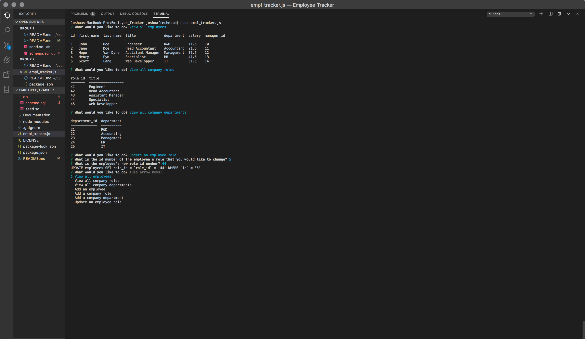

# Employee_Tracker
Assignment for UofT SCS Coding Bootcamp
Week 12

# Directions for the project

Through the CLI, the user will be prmpted to select which action they wish to take. The user can:
- View all employees
- View all company roles
- View all company departments
- Add an employee
- Add a company role
- Add a company department
- Update an employee role

If the user wishes to add an attribute, they need the respective id number, seen through viewing the relevant table.

To update an employee role, the user needs the employee number and the role's id number.

# Deployment

https://github.com/TwistedPixels/Employee_Tracker.git

# Usage

Through Visual Code CLI.

# License

MIT License

Copyright (c) 2019 Josh

Permission is hereby granted, free of charge, to any person obtaining a copy
of this software and associated documentation files (the "Software"), to deal
in the Software without restriction, including without limitation the rights
to use, copy, modify, merge, publish, distribute, sublicense, and/or sell
copies of the Software, and to permit persons to whom the Software is
furnished to do so, subject to the following conditions:

The above copyright notice and this permission notice shall be included in all
copies or substantial portions of the Software.

THE SOFTWARE IS PROVIDED "AS IS", WITHOUT WARRANTY OF ANY KIND, EXPRESS OR
IMPLIED, INCLUDING BUT NOT LIMITED TO THE WARRANTIES OF MERCHANTABILITY,
FITNESS FOR A PARTICULAR PURPOSE AND NONINFRINGEMENT. IN NO EVENT SHALL THE
AUTHORS OR COPYRIGHT HOLDERS BE LIABLE FOR ANY CLAIM, DAMAGES OR OTHER
LIABILITY, WHETHER IN AN ACTION OF CONTRACT, TORT OR OTHERWISE, ARISING FROM,
OUT OF OR IN CONNECTION WITH THE SOFTWARE OR THE USE OR OTHER DEALINGS IN THE
SOFTWARE.
